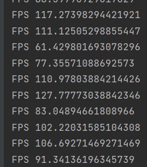

# civ6bot
    Game Interface Layer: Create scripts that can read game data and send commands (possibly using image recognition and virtual input controls).

1. Game Data Acquisition

    Screen Capture Module: Code to capture screen data for analysis.

    Fps for continuous capturing!
    Game State Parser: Software to interpret the screen capture data and convert it into a usable game state format.
    Action Interface: Code to map AI decisions to in-game actions.

2. AI Development

    AI Algorithm Files: Core AI logic and decision-making algorithms.
    Machine Learning Model Files: If using machine learning, files for training models, including neural network definitions, data preprocessing, and training scripts.
    AI Training Data Storage: Database or file system for storing training data collected from the game.

3. Integration and Testing

    Integration Scripts: Code to tie together the game data acquisition layer with the AI algorithms.
    Testing Framework: Automated tests to verify the AI's performance and reliability.
    Bug Tracking System: A system or tool to track and manage issues found during testing.

4. Training and Refinement

    Training Scripts: Automated scripts to run the game and AI for training purposes.
    Performance Metrics: Tools or scripts to evaluate the AI's performance and gather statistics.
    Refinement Tools: Utilities to fine-tune AI algorithms and parameters based on performance metrics.

5. Deployment

    Deployment Scripts: Scripts for deploying the AI, including any necessary setup on the host machine.

6. Maintenance and Updates

    Update Mechanisms: Procedures and code for updating the AI and its components.
    Maintenance Logs: Records of maintenance activities and AI performance over time.